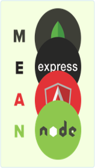

## 04. SVG
1. Implement the image (MEAN) with SVG
	* Use both circles and paths
	
* Implement the Windows 8 start screen with SVG
	
* \* Implement the first two tasks using the SVG DOM API and JavaScript
