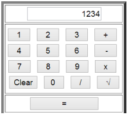

## 3. Web and HTML Controls and Events

1. Using the HTML server controls create a Web application for generating random numbers. It should have two input fields defining a range (e.g. [10..20]) and a button to generate a random number in the specified range.
2. Re-implement the same using Web server controls.
3. Define a Web form with text box and button. On button click show the entered in the first textbox text in other textbox control and label control. Enter some potentially dangerous text. Fix issues related to HTML escaping – the application should accept HTML tags and display them correctly.
4. Make a simple Web form for registration of students and courses. The form should accept first name, last name, faculty number, university (drop-down list), specialty (drop-down list) and a list of courses (multi-select list) and display them on submit. Use the appropriate Web server controls. After submission you should display summary of the entered information as formatted HTML. Use dynamically generated tags (<h1>, 
, …).
5. \*  Implement the "Tic-tac-toe" game using Web server controls. The user should play against the computer which follows some fixed strategy.
6. Make a simple Web Calculator. The calculator should support the operations like addition,  subtraction, multiplication, division and square root. Validation is essential!
		