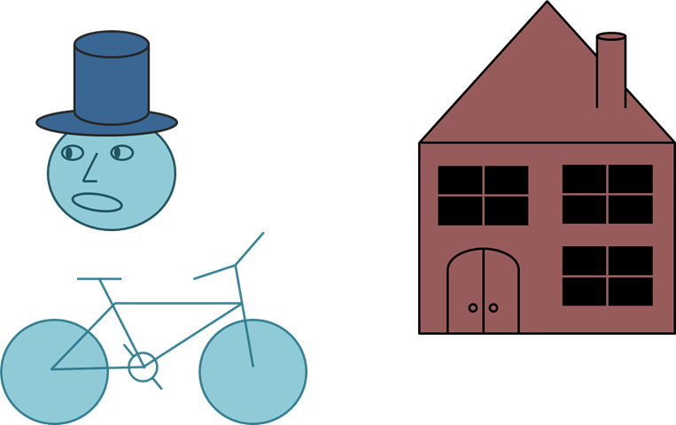

1. Draw the following graphics using canvas:
	
* Draw a circle that flies inside a box
    - When it reaches an edge, it should bounce that edge
    - 
* *Create the famous game "Snake"
    - The snake is a sequence of rectangles/ellipses
    - The snake can move left, right, up or down
    - The snake dies if it reaches any of the edges or when it tries to eat itself
    - A food should be generated:
        - When the snake eats the food, it grows and new food is generated at random position
    - Implement a high-score board, kept in localStorage

