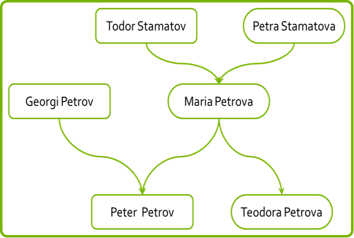

## 03. KineticJS

1. Read the tutorial on KineticJS:
	- At [http://www.html5canvastutorials.com/kineticjs/html5-canvas-events-tutorials-introduction-with-kineticjs/](http://www.html5canvastutorials.com/kineticjs/html5-canvas-events-tutorials-introduction-with-kineticjs/)
	- Read about custom shapes and text
* Using Kinetic create a family tree
	

	```javascript
	var familyMembers = [{
	  mother: 'Maria Petrova',
	  father: 'Georgi Petrov',
	  children: ['Teodora Petrova', 'Peter Petrov']
	}, {
	  mother: 'Petra Stamatova',
	  father: 'Todor Stamatov',
	  children: ['Maria Petrova']
	}]
	```

