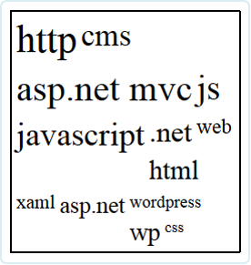
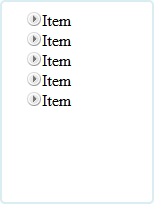
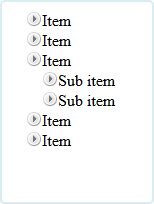
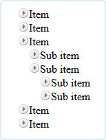

## 07. DOM Operations
1. Write a script that creates a number of div elements. Each div element must have the following
    * Random width and height between 20px and 100px
    * Random background color
    * Random font color
    * Random position on the screen (position:absolute)
    * A strong element with text "div" inside the div
    * Random border radius
    * Random border color
    * Random border width between 1px and 20px
* Write a script that creates 5 div elements and moves them in circular path with interval of 100 milliseconds
* Create a text area and two inputs with type="color"
    * Make the font color of the text area as the value of the first color input
    * Make the background color of the text area as the value of the second input
* Create a tag cloud:
    * Visualize a string of tags (strings) in a given container
    * By given minFontSize and maxFontSize, generate the tags with different font-size, depending on the number of occurrences
    ```html
    var tags = ["cms", 
        "javascript", "js", "ASP.NET MVC", 
        ".net", ".net", "css", "wordpress", 
        "xaml", "js", "http", "web", "asp.net", 
        "asp.net MVC", "ASP.NET MVC", 
        "wp", "javascript", "js", "cms", 
        "html", "javascript", "http", "http", "CMS"]
    var tagCloud = generateTagCloud(tags,17,42);
    ```
    
* \*Create a TreeView component
    * Initially only the top items must be visible
    
    * On item click
        * If its children are hidden (collapsed), they must be made visible (expanded)
         
        * If its children are visible (expanded), they must be made hidden (collapsed)
         
    * Research about events


