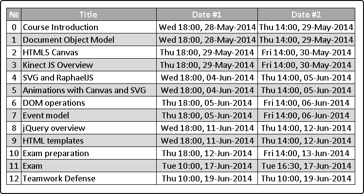
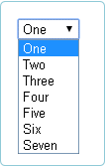

## 11. HTML Templates
1. Create the following using Handlebars.js
    
* Create a dynamic select using Handlebars.js
    * The options in the select should be generated based on a collection of JavaScript objects
    * Example:
    ```js
        var items = [{
          value: 1,
          text: 'One'
        }, {
          value: 2,
          text: 'Two'
        }];
        var selectHTML = selectTemplate(items);
    ```
    
* \* Create a jQuery plugin for ListView
    * Apply a template for each item of a collection
    * Using the `data-template` attribute set the ID of the template to use for the items
    * Must work with different collections and templates
    ```html
        <ul id="books-list"     data-template="book-item-template"></ul>
        <script id="book-item-template" type="…">
          <li class="book-item">
            <a href="/#books/{{id}}">
              <strong>{{title}}</strong>
            </a>
          </li>	
        </script>
    ```
    ```js
        $('#books-list').listview(books);
    ```
    * or
    ```html
        <table>
          <thead>
            <tr><th>#</th><th>Name</th><th>Mark</th></tr>
          </thead>
          <tbody id="students-table"          data-template="students-row-template">	
          </tbody>
        </table>
        <script id="students-row-template" type="…">
          <tr class="student-row">
            <td>{{number}}</td>
            <td>{{name}}</td>
            <td>{{mark}}</td>
          </tr>		
        </script>
    ```
    ```js
        $('#students-table').listview(students);
    ```
* \* Extend the previous task to set the template inside the DOM element, instead of setting it with data-template
    
    ```html
        <table>
          <thead>
            <tr><th>#</th><th>Name</th><th>Mark</th></tr>
          </thead>
          <tbody id="students-table">
            <tr class="student-row">
              <td>{{number}}</td>
              <td>{{name}}</td>
              <td>{{mark}}</td>
            </tr>		
          </tbody>
        </table>
    ```
    
    ```js
        $('#students-table').listview(students);
    ```
